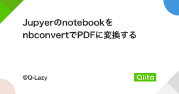

# 【texlive-minimal】

*特定用途に限定した最小構成のパッケージセット*

### 〈ファイルの概要〉

[][1]

Qiitaに投稿した記事で使用する[TeX Live][2]のパッケージセットをZIPファイルにまとめて掲載しています。<br>

[1]: https://qiita.com/Q-Lazy/items/8539f9c4ff77d3036b8f "JupyerのnotebookをnbconvertでPDFに変換する"
[2]: https://tug.org/texlive/

### 〈パッケージの内容〉

[Google Cloud Shell](https://shell.cloud.google.com/)で[Jupyter Lab][3]の拡張機能**nbconvert**によりPDFを出力することを目的とした必要最小限のパッケージセット。以下に収録内容の一覧を掲載します。

◆パッケージコレクション

- Essential programs and files
- BibTeX additional styles 
- XeTeX and packages

◆個別追加パッケージ
```
tcolorbox pgf environ etoolbox parskip caption float upquote eurosym fontspec unicode-math
fancyvrb adjustbox xkeyval collectbox titling booktabs enumitem ulem jknapltx rsfs
gettitlestring ucs
```

◆日本語対応のためのパッケージ
```
bxjscls zxjatype xecjk haranoaji</pre>
```

ドキュメントまで含めると、ディスクの占有サイズが約2倍になってしまうので除外していますが、ブラウザにより[公式サイトのドキュメント][4]を参照するか、[PDFの日本語マニュアル][5]も入手出来るので問題無いはずです。

[3]: https://jupyterlab.readthedocs.io/
[4]: https://tug.org/texlive/doc/texlive-en/texlive-en.html
[5]: https://tug.org/texlive/doc/texlive-ja/texlive-ja.pdf

### 〈ZIPファイルの使用法〉

まず下記のコマンドでZIP形式の圧縮ファイルをダウンロードします。ファイルサイズは260MBほどです。<br>
**LFTP**や**aria2**が導入済みであれば、それらのほうが高速なので、ダウンロード時間を短縮できます。<br>

```shell
wget https://github.com/singularity-effect/texlive-minimal/releases/download/20220611/texlive20220611.zip
```

次に圧縮されたZIPファイルを展開しますが、ホームディレクトリのディスク容量を550MB程度消費します。<br>
途中で空き容量が逼迫しないように、いったんホームディレクトリの上位の別ボリュームのディレクトリに移動することとします。
インストール先のディレクトリはホームディレクトリ直下の`.local`ディレクトリです。

```shell
sudo mv ~/texlive20220611.zip /var/
mkdir -pv ~/.local; cd ~/.local
unzip /var/texlive20220611.zip
```
もし**7-Zip**を導入済みであれば、そちらを使って展開したほうが高速なので、かなり所要時間を短縮できます。

### 〈その他〉

2022年6月時点に作成しました。初期設定や使用方法に関しては[Qiitaの記事][10]をご覧ください。

[10]:https://qiita.com/Q-Lazy/items/8539f9c4ff77d3036b8f "JupyerのnotebookをnbconvertでPDFに変換する"
